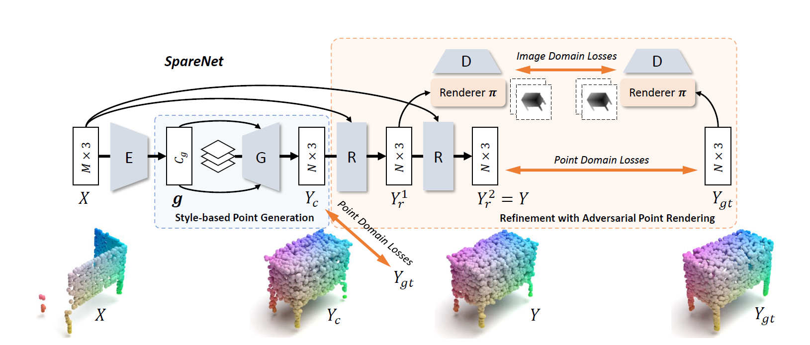

# SpareNet Lib for Point Cloud Completion Modeling

An efficient PyTorch library for Point Cloud Completion modeling. 



## Highlights

- **Distributed** training framework.
- **Fast** training speed.
- **Modular** design for prototyping new models.
- **Model zoo** containing a rich set of models

We will also support following functions *in the very near future*. Please **STAY TUNED**.

- Training of PGGAN and StyleGAN2 (and likely BigGAN too).
- Benchmark on model training.
- Training of GAN encoder from [In-Domain GAN Inversion](https://genforce.github.io/idinvert).
- Other recent work from our [GenForce](http://genforce.github.io/).

## Installation

1. Create a virtual environment via `conda`.

   ```shell
   conda create -n sparenet python=3.7
   conda activate sparenet
   ```

2. Install `torch` and `torchvision`.

   ```shell
   conda install pytorch cudatoolkit=10.1 torchvision -c pytorch
   ```

3. Install requirements.

   ```shell
   pip install -r requirements.txt
   ```

4. Install cuda
   ```shell
   sh setup_env.sh
   ```


## Dataset


We have downloaded [the processed ShapeNet dataset](https://gateway.infinitescript.com/?fileName=ShapeNetCompletion) to the following directories:

- blob container: `/mnt/blob/ShapeNetCompletion/`
- msragpum16: `/home/v-chulx/code/Datasets/ShapeNetCompletion/`

We have downloaded [Completion3D dataset](http://download.cs.stanford.edu/downloads/completion3d/dataset2019.zip) to the following directories:
  - blob container: `/mnt/blob/pointcloud.pytorch/data/shapenet/`
  - msragpum16: `/home/v-chulx/code/completion3d/data/shapenet`


We have downloaded [KITTI dataset](https://drive.google.com/drive/folders/1fSu0_huWhticAlzLh3Ejpg8zxzqO1z-F) to the following
  - msragpum16: `/home/haya/LocalBlob/others/v-chuxwa/KITTI`


## Get Started

### Test

The pretrained models:

- [PCN for ShapeNet](https://drive.google.com/drive/folders/1ruN16MlJm4OeRMd41C19HyWqYOIrNrNh)
- [GRNet for ShapeNet](https://gateway.infinitescript.com/?fileName=GRNet-ShapeNet.pth) (306.8 MB)
- [GRNet for KITTI](https://gateway.infinitescript.com/?fileName=GRNet-KITTI.pth) (306.8 MB)
- [MSN for ShapeNet](https://drive.google.com/drive/folders/14UZXKqXIZ0gL3hhrV2ySll_pH2eLGFL5) (8192 points)

Our previous experiment results and data path of pretrained models are [here](https://docs.google.com/spreadsheets/d/1UsDwIUvi-CPwS9ApuvP1a6GOyjONlIN1U-8rzk3WYxw/edit?usp=sharing).
Our recent experiment report is put [here](https://docs.google.com/document/d/1K-4_6QfXClDu0val0OT5m6_tK0efERaSYmDj2RBHC6Q/edit?usp=sharing).

- On local machine or Using `philly`

  ```shell
  python  --gpu ${GPUS}\
          --work_dir ${WORK_DIR} \
          --model ${network} \
          --weights ${path to checkpoint} \
          --test_mode ${mode}
  ```

### Train

All log files in the training process, such as log message, checkpoints, etc, will be saved to the work directory.

- On local machine or Using `philly`

  ```shell
  python  --gpu ${GPUS}\
          --work_dir ${WORK_DIR} \
          --model ${network} \
          --weights ${path to checkpoint}
  ```

## Contributors


## License

The project is under the .

## Acknowledgement

We thank for the inspiration on the design of controllers.

## BibTex

<!-- We open source this library to the community to facilitate the research of generative modeling. If you do like our work and use the codebase or models for your research, please cite our work as follows.

```bibtex
@misc{genforce2020,
  title =        {GenForce},
  author =       {Shen, Yujun and Xu, Yinghao and Yang, Ceyuan and Zhu, Jiapeng and Zhou, Bolei},
  howpublished = {\url{https://github.com/genforce/genforce}},
  year =         {2020}
}
``` -->