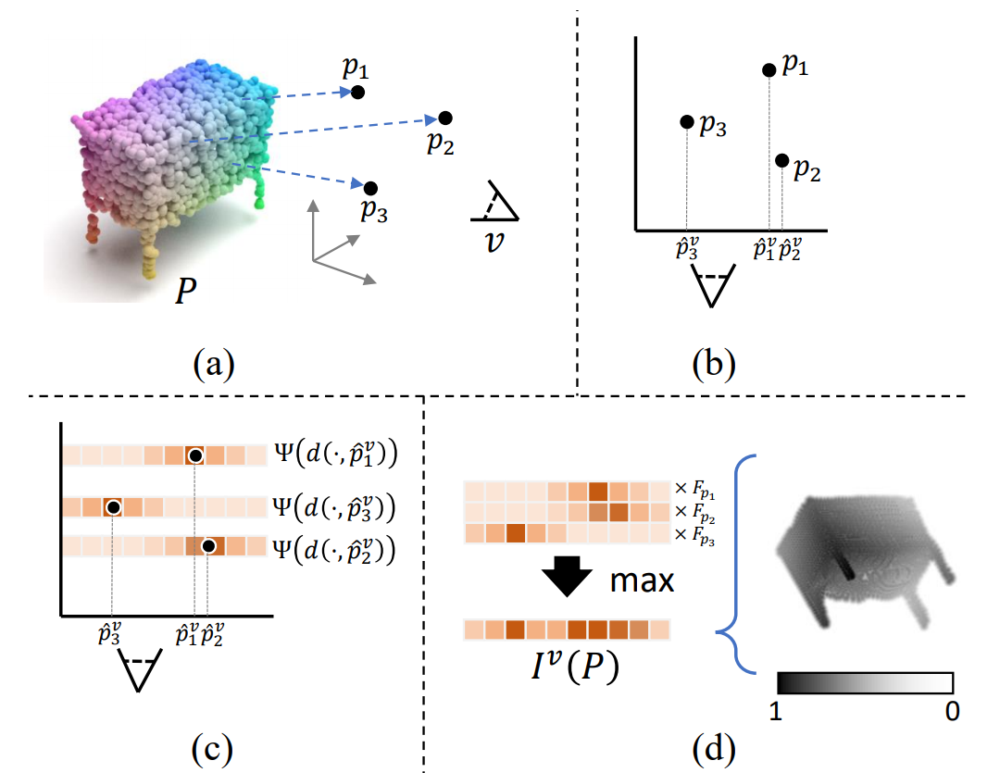

# Style-based Point Generator with Adversarial Rendering for Point Cloud Completion (CVPR 2021)

An efficient PyTorch library for Point Cloud Completion. 

<!--  -->
<div  align="center">    

</div>

### [Project page](https://alphapav.github.io/SpareNet/) |   [Paper]() | [Video]()

[Chulin Xie*](https://github.com/AlphaPav), [Chuxin Wang*](https://github.com/XinYuan-believe), [Bo Zhang](https://www.microsoft.com/en-us/research/people/zhanbo/), [Hao Yang](https://www.microsoft.com/en-us/research/people/haya/), [Dong Chen](https://www.microsoft.com/en-us/research/people/doch/), and [Fang Wen](https://www.microsoft.com/en-us/research/people/fangwen/).

## Abstract
>We proposed a novel Style-based Point Generator with Adversarial Rendering (SpareNet) for point cloud completion. Firstly, we present the channel-attentive EdgeConv to fully exploit the local structures as well as the global shape in point features. Secondly, we observe that the concatenation manner used by vanilla foldings limits its potential of generating a complex and faithful shape. Enlightened by the success of StyleGAN, we regard the shape feature as style code that modulates the normalization layers during the folding, which considerably enhances its capability. Thirdly, we realize that existing point supervisions, e.g., Chamfer Distance or Earth Mover’s Distance, cannot faithfully reflect the perceptual quality of the reconstructed points. To address this, we propose to project the completed points to depth maps with a differentiable renderer and apply adversarial training to advocate the perceptual realism under different viewpoints. Comprehensive experiments on ShapeNet and KITTI prove the effectiveness of our method, which achieves state-of-the-art quantitative performance while offering superior visual quality.


## Installation

1. Create a virtual environment via `conda`.

   ```shell
   conda create -n sparenet python=3.7
   conda activate sparenet
   ```

2. Install `torch` and `torchvision`.

   ```shell
   conda install pytorch cudatoolkit=10.1 torchvision -c pytorch
   ```

3. Install requirements.

   ```shell
   pip install -r requirements.txt
   ```

4. Install cuda
   ```shell
   sh setup_env.sh
   ```


## Dataset
* Download [the processed ShapeNet dataset](https://gateway.infinitescript.com/?fileName=ShapeNetCompletion) generated by [GRNet](https://github.com/hzxie/GRNet), and the [KITTI dataset](https://drive.google.com/drive/folders/1fSu0_huWhticAlzLh3Ejpg8zxzqO1z-F). 

* Update the file path of the datasets in `configs/base_config.py`:

   ```
   __C.DATASETS.shapenet.partial_points_path = "/path/to/datasets/ShapeNetCompletion/%s/partial/%s/%s/%02d.pcd"
   __C.DATASETS.shapenet.complete_points_path = "/path/to/datasets/ShapeNetCompletion/%s/complete/%s/%s.pcd"
   __C.DATASETS.kitti.partial_points_path = "/path/to/datasets/KITTI/cars/%s.pcd"
   __C.DATASETS.kitti.bounding_box_file_path = "/path/to/datasets/KITTI/bboxes/%s.txt"

   # Dataset Options: ShapeNet, ShapeNetCars, KITTI
   __C.DATASET.train_dataset = "ShapeNet"
   __C.DATASET.test_dataset = "ShapeNet"
   ```


## Get Started

### Inference Using Pretrained Model

The pretrained models:

- [SpareNet for ShapeNet](https://drive.google.com/file/d/15PiH-bRlSlK4AUUnVwREzuAlMVJ9TfQG) (316 MB)
- [PCN for ShapeNet](https://drive.google.com/drive/folders/1ruN16MlJm4OeRMd41C19HyWqYOIrNrNh)
- [GRNet for ShapeNet](https://gateway.infinitescript.com/?fileName=GRNet-ShapeNet.pth) (307 MB)
- [GRNet for KITTI](https://gateway.infinitescript.com/?fileName=GRNet-KITTI.pth) (307 MB)
- [MSN for ShapeNet](https://drive.google.com/drive/folders/14UZXKqXIZ0gL3hhrV2ySll_pH2eLGFL5) (8192 points)


-  run

   ```shell
   python   --gpu ${GPUS}\
            --work_dir ${WORK_DIR} \
            --model ${network} \
            --weights ${path to checkpoint} \
            --test_mode ${mode}
   ```

-  example
   ```shell
   python  test.py --gpu 0 --work_dir /path/to/logfiles --model sparenet --weights /path/to/cheakpoint --test_mode default
   ```

### Train

All log files in the training process, such as log message, checkpoints, etc, will be saved to the work directory.

-  run

   ```shell
   python   --gpu ${GPUS}\
            --work_dir ${WORK_DIR} \
            --model ${network} \
            --weights ${path to checkpoint}
   ```
-  example
   ```shell
   python  train.py --gpu 0,1,2,3 --work_dir /path/to/logfiles --model sparenet --weights /path/to/cheakpoint
   ```

<!-- ## Contributors -->

## Differentiable Renderer
A fully differentiable point renderer that enables end-to-end rendering from 3D point cloud to 2D depth maps. See the paper for details.

<!--  -->
<div  align="center">    

</div>

### Usage of Renderer

The inputs of renderer are pcd, views and radius, and the outputs of renderer are depth_maps.
-  example
   ```shell
   renderer = ComputeDepthMaps(projection_mode, eyepos_scale, image_size)
   renderer(data, view_id, radius_list)
   ```

## License

The codes and the pretrained model in this repository are under the MIT license as specified by the LICENSE file. 

This project has adopted the [Microsoft Open Source Code of Conduct](https://opensource.microsoft.com/codeofconduct/). For more information see the [Code of Conduct FAQ](https://opensource.microsoft.com/codeofconduct/faq/) or contact [opencode@microsoft.com](mailto:opencode@microsoft.com) with any additional questions or comments.


## BibTex

If you like our work and use the codebase or models for your research, please cite our work as follows.

```bibtex
@misc{xx,
  title =        {xxx},
  author =       {xx},
  howpublished = {xx},
  year =         {2021}
}
``` 

<!-- ## Acknowledgement
We thank for the inspiration from [MSN]() and [GRNet]() -->
